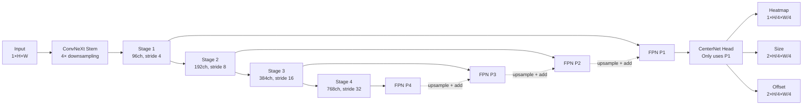
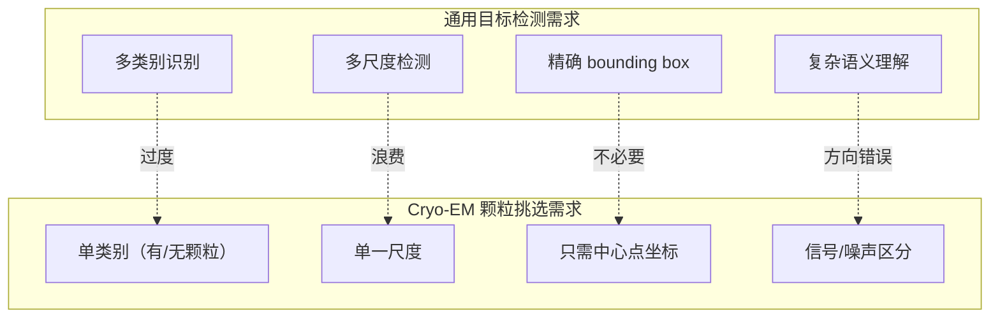

# SuPicker 网络架构适用性分析

> 基于冷冻电镜(Cryo-EM)成像物理特性的客观分析

---

## 一、Cryo-EM 图像与颗粒的核心特征回顾

在评估网络架构之前，必须先精确理解目标场景的物理特征：

### 1.1 图像层面

| 特征 | 描述 |
|------|------|
| **极低信噪比 (SNR)** | Cryo-EM 图像 SNR 通常在 0.01–0.1 之间，颗粒信号完全淹没在噪声中，肉眼几乎不可见 |
| **高动态范围 / 非均匀灰度** | 冰层厚度变化导致背景灰度渐变；碳膜区域与冰区域对比度差异大 |
| **CTF 调制效应** | 对比度传递函数(CTF)导致图像中存在同心圆环状的频率依赖相位翻转，同一颗粒在不同欠焦下外观可能完全不同 |
| **灰度图像** | 单通道，无颜色信息 |
| **超大尺寸** | 典型 micrograph 为 4096×4096 或 5760×4092 像素 |
| **全局纹理单一** | 不像自然图像有丰富纹理/边缘，Cryo-EM 图像的有效信号几乎全是低频弱对比度 |

### 1.2 颗粒层面

| 特征 | 描述 |
|------|------|
| **近似圆形/球形投影** | 多数蛋白颗粒的 2D 投影接近圆形，宽高比接近 1:1 |
| **尺寸单一** | 同一数据集中所有颗粒尺寸基本一致（同一种蛋白） |
| **随机取向** | 颗粒在冰层中方向随机，产生不同视角的投影 |
| **密集分布** | 真实 micrograph 中颗粒可能数百到上千个，且可能紧密排列(touching/overlapping) |
| **与噪声难以区分** | 单个颗粒与局部噪声模式外观高度相似 |
| **无 bounding box 概念** | 颗粒检测本质上是"找中心点"任务，不涉及矩形框回归 |

---

## 二、当前架构总览

```
Input(1, H, W) → ConvNeXt(Backbone) → FPN(Neck) → CenterNet(Head) → {heatmap, size, offset}
```



### 核心组件

| 组件 | 实现 | 关键参数 |
|------|------|----------|
| **Backbone** | ConvNeXt (Tiny/Small/Base) | depths=[3,3,9,3], dims=[96,192,384,768] |
| **Stem** | 4×4 Conv, stride=4 | 1ch → 96ch |
| **Neck** | Standard FPN | 4-level, 256ch output |
| **Head** | CenterNet (shared conv + 3 branches) | heatmap, size, offset |
| **Loss** | Focal + L1 | heatmap_w=1.0, size_w=0.1, offset_w=1.0 |
| **Output stride** | 4× | heatmap resolution = input/4 |

---

## 三、逐模块适用性分析

### 3.1 Backbone: ConvNeXt

#### ✅ 合理之处

1. **ImageNet 预训练迁移**：虽然 Cryo-EM 是灰度的，但通过 RGB→Gray 权重平均适配（代码中已实现），低层特征（边缘、纹理）仍有价值
2. **LayerNorm + GELU**：相比 BN+ReLU 对小 batch、低 SNR 场景更稳定
3. **大核深度可分离卷积 (7×7 DWConv)**：较大的感受野有助于在噪声中捕捉全局上下文

#### ⚠️ 值得审视的问题

| 问题 | 分析 |
|------|------|
| **网络容量过大** | ConvNeXt-Tiny 有 ~28M 参数。Cryo-EM 颗粒检测本质是"在噪声背景中找弱对比度圆斑"，特征空间远比 ImageNet 1000 类简单。Tiny 可能已经过大，Small/Base 更是不必要。过大的网络在有限训练数据下会过拟合噪声而非学习真正的颗粒信号 |
| **Stem 下采样过于激进** | 4×4 stride-4 的 stem 一步将分辨率降低 4 倍。对于 Cryo-EM 中粒径 ~50–200 px 的颗粒，经过 stem 后颗粒仅占 ~12–50 px，进一步经过 downsamples 后到 Stage 4 时颗粒仅 ~1–6 px。这对小颗粒是灾难性的精度损失 |
| **深层特征对此任务价值有限** | Stage 3/4 的高级语义特征对"理解物体是什么"有用，但 Cryo-EM 颗粒没有复杂语义——关键是低层的"存在一个与背景不同的弱对比度团块"。过深的网络可能引入不必要的计算和过拟合风险 |
| **缺乏频域感知** | CTF 效应是频域现象，纯空域卷积网络对 CTF 导致的对比度翻转(contrast reversal)缺乏内在理解能力 |

### 3.2 Neck: FPN

#### ✅ 合理之处

1. **Top-down 特征融合**：将高层语义信息回传给低层有助于降噪
2. **多尺度架构**：即使当前只用 P1，FPN 的融合逻辑使 P1 富含全局上下文

#### ⚠️ 值得审视的问题

| 问题 | 分析 |
|------|------|
| **只使用 P1 输出** | `detector.py` 第 42 行：`outputs = self.head(fpn_features[0])`。FPN 计算了 4 个层级的特征但只用了 P1，这意味着 P2/P3/P4 的计算是纯浪费。如果确实只需要单一尺度（cryo-EM 颗粒尺寸一致），那么 FPN 的多尺度设计就是过度工程 |
| **FPN 过于简单** | 标准 FPN 只有简单的 add + 3×3 conv smooth。对于 Cryo-EM 的低 SNR，可能需要更强的特征融合(如 BiFPN 的加权融合、attention-based 融合)来实现更有效的去噪 |
| **缺乏逐层归一化** | FPN 的 lateral 和 output conv 后没有使用 normalization，可能导致不同尺度特征相加时的尺度不匹配 |

### 3.3 Head: CenterNet

#### ✅ 合理之处

1. **Anchor-free 设计完美匹配颗粒检测**：颗粒检测本质是中心点定位(point detection)，CenterNet 的 heatmap 回归范式天然适合，避免了 anchor 设计中对先验框尺寸/比例的依赖
2. **Heatmap + offset 的亚像素定位**：output_stride=4 通过 offset 回归实现亚像素精度
3. **Focal loss 的 bias 初始化 (-2.19)**：正确的做法，避免训练初期正样本被负样本淹没

#### ⚠️ 值得审视的问题

| 问题 | 分析 |
|------|------|
| **size 分支的必要性存疑** | Cryo-EM 同一数据集中颗粒尺寸几乎一致，size 回归分支（预测 width/height）是从通用目标检测中带来的冗余设计。在 RELION/CryoSPARC 的下游工作流中，都是使用统一的 box size 提取颗粒。这个分支不仅浪费参数和计算，还可能因训练目标不一致(heatmap loss vs size loss)而干扰主任务的学习 |
| **BatchNorm 在 Head 中** | Head 使用 BN，而 Backbone 使用 LN，混合使用可能在小 batch 场景下引起不稳定。特别是 validation 时 batch_size=2，BN 的统计量可能不准确 |
| **shared_conv 太浅** | 只有一层 3×3 conv 作为共享特征提取，可能不足以为三个分支提供足够丰富的特征 |
| **Gaussian sigma 固定** | `gaussian_sigma=2.0` 是硬编码的。不同的颗粒直径应该对应不同的 Gaussian radius（CenterNet 原始论文中，sigma 是由目标尺寸动态计算的）。固定 sigma 会导致大颗粒的 heatmap 峰值太窄、小颗粒的太宽 |

### 3.4 Loss 设计

#### ✅ 合理之处

1. **Focal loss 用于 heatmap** 是 CenterNet 的标准做法
2. **α=2, β=4** 是经过验证的默认参数
3. **AMP 兼容的 float32 cast** 设计良好

#### ⚠️ 值得审视的问题

| 问题 | 分析 |
|------|------|
| **损失权重可能不平衡** | `heatmap_weight=1.0, size_weight=0.1, offset_weight=1.0`。size_weight=0.1 说明已经意识到 size 不重要，但更好的做法可能是完全去掉 size 分支 |
| **缺乏对 Cryo-EM 特有困难的适配** | 没有针对冰晶(ice contamination)、碳膜边缘等常见假阳性源的特殊处理 |

### 3.5 数据管线

#### ✅ 合理之处

1. **RandomCrop 训练**：解决了大图(4K+) 的内存问题
2. **丰富的几何增强**：水平/垂直翻转、90°旋转、任意角旋转，对旋转不变的颗粒完全合理
3. **STAR 文件支持**：与 RELION 生态系统兼容

#### ⚠️ 值得审视的问题

| 问题 | 分析 |
|------|------|
| **归一化方式过于简单** | 只做了 min-max 到 [0,1] 然后 z-score 归一化。Cryo-EM 图像有极端异常值(hot pixels, dead pixels)，应先做百分位截断(如 clip 到 0.1%–99.9% percentile) |
| **缺乏 CTF 感知增强** | `ctf_simulation: bool = False` 存在但未实现。CTF 增强可以让模型学习对不同欠焦量的鲁棒性 |
| **噪声增强强度不足** | `noise_std=0.02` 对于 SNR≈0.05 的 Cryo-EM 图像几乎可忽略。真实数据中的噪声远比这强烈 |
| **缺乏频域增强** | 没有对功率谱进行增强（如随机滤波、频率掩码），而频域信息对 Cryo-EM 非常重要 |
| **BrightnessContrast 的实现有 bug** | 第 173 行 `image = (image - mean) * contrast + mean * brightness`，brightness 和 contrast 的操作互相耦合了，不是标准的独立调节 |

---

## 四、与场景的核心错配

### 4.1 ❌ 根本性问题：「通用目标检测」模型硬套「点检测」任务

SuPicker 的架构本质上是一个通用目标检测器(ConvNeXt + FPN + CenterNet)的直接移植，对 Cryo-EM 颗粒挑选的物理特点考虑不足：



### 4.2 ❌ 对低 SNR 的处理缺乏设计

网络中没有任何专门针对低 SNR 条件的设计：
- 没有去噪预处理/模块
- 没有 attention 机制帮助聚焦信号区域
- 没有利用颗粒的重复性/统计特性(Cryo-EM 中同一种颗粒大量重复出现)

### 4.3 ❌ 完全忽略成像物理(CTF)

CTF 是 Cryo-EM 最核心的物理特征。现有网络：
- 没有 CTF 参数作为输入条件
- 没有频域处理模块
- 没有 CTF 增强用于训练

---

## 五、真实可行的优化方向

按 **预期收益/实施难度** 排序：

### 第一优先级：低成本高收益

#### 5.1 去掉 size 分支，简化为纯点检测

```diff
- class CenterNetHead:  # 3 分支: heatmap + size + offset
+ class PointDetectionHead:  # 2 分支: heatmap + offset
```

**理由**：颗粒尺寸在训练前就已知且统一，size 分支纯属冗余。去掉后：
- 减少 ~30% 的 head 参数
- 消除 size loss 对 heatmap loss 的干扰
- 简化推理管线

#### 5.2 自适应 Gaussian sigma

将 `gaussian_sigma` 从固定值改为根据颗粒尺寸自适应计算：

```python
# 当前：固定 sigma=2.0
radius = max(int(self.gaussian_sigma * 3), 1)

# 改进：根据颗粒实际尺寸动态计算
particle_radius = min(p["width"], p["height"]) / (2 * self.output_stride)
sigma = max(particle_radius / 3, 1.0)
```

**理由**：CenterNet 原始论文中原本就是自适应的，当前的固定值是简化实现。

#### 5.3 改进数据归一化

```python
# 当前：简单 min-max
image = (image - image.min()) / (image.max() - image.min() + 1e-8)

# 改进：百分位截断 + z-score
p_low, p_high = np.percentile(image, [0.1, 99.9])
image = np.clip(image, p_low, p_high)
image = (image - image.mean()) / (image.std() + 1e-8)
```

**理由**：避免热像素/坏像素对归一化的影响，这在 Cryo-EM 数据中是常见问题。

### 第二优先级：中等投入、明确收益

#### 5.4 精简 Backbone

当前 ConvNeXt 对颗粒挑选来说过重。两种可行方向：

- **方案 A**：减少 ConvNeXt 的深度，如 depths=[2,2,4,2]
- **方案 B**：考虑换用更轻量的 backbone，如 ResNet-18/34，或自定义的浅层 ConvNeXt

> 一个轻量 backbone 辅以适当的预训练权重，在这个任务上可能表现更好（更少过拟合，更快收敛）。

#### 5.5 简化或替换 FPN

既然只使用 P1，有两个方向：

- **方案 A**：去掉 FPN，直接从 backbone 的早期 stage 输出，配合简单的上采样解码器
- **方案 B**：保留 FPN 但改为只跑 2 层（Stage 1 + Stage 2），节省 Stage 3/4 的计算

```python
# 当前：4-stage backbone + 4-level FPN → 只用 P1
# 改进方案 A：2-stage backbone + simple decoder → 单尺度输出
```

#### 5.6 添加 Channel Attention (SE/CBAM)

在 FPN 的输出或 Head 的输入之前添加通道注意力：

```python
class SEBlock(nn.Module):
    def __init__(self, channels, reduction=16):
        super().__init__()
        self.squeeze = nn.AdaptiveAvgPool2d(1)
        self.excitation = nn.Sequential(
            nn.Linear(channels, channels // reduction),
            nn.ReLU(),
            nn.Linear(channels // reduction, channels),
            nn.Sigmoid(),
        )
    
    def forward(self, x):
        b, c, _, _ = x.shape
        w = self.squeeze(x).view(b, c)
        w = self.excitation(w).view(b, c, 1, 1)
        return x * w
```

**理由**：帮助网络自动学习哪些特征通道对"从噪声中区分颗粒信号"最重要。

### 第三优先级：高投入、高上限

#### 5.7 引入 Deformable Convolution

颗粒虽然是近似圆形但存在构象变化，deformable conv 可以让网络自适应地调整感受野形状：

```python
# 在 Head 中用 deformable conv 替代标准 conv
from torchvision.ops import DeformConv2d
```

#### 5.8 CTF 感知设计

两个层次的实现路径：

1. **CTF 增强训练**（中等难度）：实现 `ctf_simulation` 数据增强，在训练时随机模拟不同的 defocus 值
2. **CTF 条件输入**（较高难度）：将 defocus 值作为条件注入网络（类似 conditional-BN）

#### 5.9 频域辅助分支

添加一个并行分支处理频域特征：

```python
class FrequencyBranch(nn.Module):
    """Process power spectrum features in parallel."""
    def forward(self, x):
        # Compute power spectrum
        fft = torch.fft.rfft2(x)
        power = torch.abs(fft)
        # Process with small CNN
        return self.freq_conv(power)
```

将频域特征与空域特征在 neck 阶段融合，利用 Thon rings 等频域特征辅助判断。

---

## 六、优先级总结

| 优先级 | 优化项 | 预期收益 | 实施难度 | 风险 |
|--------|--------|----------|----------|------|
| 🟢 P0 | 去掉 size 分支 | 减少过拟合，简化管线 | 低 | 极低 |
| 🟢 P0 | 自适应 Gaussian sigma | 提高 heatmap 质量 | 低 | 低 |
| 🟢 P0 | 改进数据归一化(百分位截断) | 提高训练稳定性 | 低 | 极低 |
| 🟡 P1 | 精简 Backbone 深度/宽度 | 减少过拟合，加速训练 | 中 | 中 |
| 🟡 P1 | 简化 FPN 或换 decoder | 减少无效计算 | 中 | 中 |
| 🟡 P1 | 添加 Channel Attention | 提升信噪比区分能力 | 低-中 | 低 |
| 🔵 P2 | Deformable Conv | 适应构象变化 | 中 | 中 |
| 🔵 P2 | CTF 增强训练 | 提升跨 defocus 泛化 | 中-高 | 中 |
| 🔵 P2 | 频域辅助分支 | 利用物理先验 | 高 | 高 |

---

## 七、结论

SuPicker 的 **ConvNeXt + FPN + CenterNet** 架构方向是合理的——CenterNet 的 heatmap 范式天然适合颗粒的中心点检测任务。但在实现层面，存在明显的「通用目标检测框架直接搬用」问题，对 Cryo-EM 的 **低 SNR、单尺度、单类别、无需 bounding box** 等核心特征缺乏针对性设计。

最大的优化空间在于**做减法**：

1. **去掉不需要的模块**（size 分支、过深的 backbone stages、未使用的 FPN 层级）
2. **针对性加强薄弱环节**（数据归一化、Gaussian sigma 自适应、注意力机制）
3. **长期引入物理先验**（CTF 感知、频域处理）

简化后的模型不仅会更快、更省显存，而且因为更少的过拟合风险，在有限的 Cryo-EM 训练数据上反而可能表现更好。
